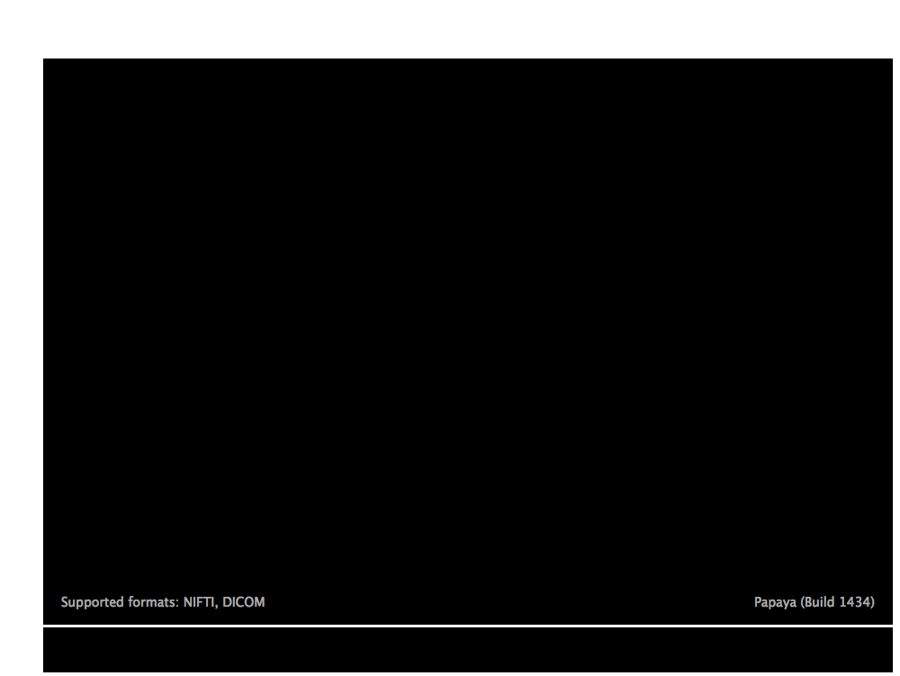

<!-- README.md is generated from README.Rmd. Please edit that file -->

[](https://travis-ci.com/muschellij2/papayaWidget)

# papayaWidget

The goal of papayaWidget is to include a [`papaya`
object](http://ric.uthscsa.edu/mango/papaya.html) in an Rmarkdown
document.

See the full docs at <http://johnmuschelli.com/papayaWidget>.

## Installation

You can install the `papayaWidget` using:

``` r
# install.packages("papayaWidget")
devtools::install_github("muschellij2/papayaWidget")
```

## Example

This is a basic example which shows you how to solve a common problem:

``` r
library(kirby21.t1)
library(papayaWidget)
library(neurobase)
#> Loading required package: oro.nifti
#> oro.nifti 0.9.11
outdir = tempdir()
download_t1_data(outdir = outdir)
#> cloning into '/var/folders/1s/wrtqcpxn685_zk570bnx9_rr0000gr/T//RtmpaCawuX/fileff7e5a955b14/kirby21.t1'...
#> Receiving objects:   1% (2/117),    8 kb
#> Receiving objects:  11% (13/117),    8 kb
#> Receiving objects:  21% (25/117),    8 kb
#> Receiving objects:  31% (37/117),    8 kb
#> Receiving objects:  41% (48/117),    8 kb
#> Receiving objects:  51% (60/117), 30699 kb
#> Receiving objects:  61% (72/117), 46544 kb
#> Receiving objects:  71% (84/117), 46544 kb
#> Receiving objects:  81% (95/117), 46544 kb
#> Receiving objects:  91% (107/117), 46544 kb
#> Receiving objects: 100% (117/117), 46544 kb, done.
#> [1] TRUE
fname = kirby21.t1::get_t1_filenames(outdir = outdir)
fname = fname[1]
img = readnii(fname)
papaya(img)
```


